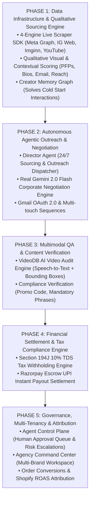

# 🎯 Product Master Game Plan: AI-Native Influencer Marketing OS

Building an **AI-Native Influencer Marketing Platform** requires replacing manual marketing agency operations with a deterministic, event-driven agentic state machine. 

Below is the **5-Phase Architectural Blueprint & Product Game Plan** that governs **Project X**.

---

## 🗺️ Master Product Roadmap & Architectural Flow

---

## 🚀 The 5 Core Product Pillars Breakdown

### 1️⃣ Phase 1: Data Infrastructure & Qualitative Sourcing Engine
> **Goal**: Replace simple keyword lookups with context-rich qualitative creator intelligence.

* **4-Engine Live Scraper SDK (`creatorScraperSdk.js` & `realScraperEngine.js`)**:
  - Pulls real-time creator metrics directly via Meta Graph API, IG Web API, Imginn HTML Parser, and YouTube Data API.
* **Qualitative Scoring Parameters**:
  - Evaluates HD avatars/PFPs (via `unavatar.io`), bio semantics, verified business emails, engagement velocity, and average reel views.
* **Creator Memory & Relationship Graph (`creator_memory` & `creatorMemoryService.js`)**:
  - Eliminates "cold start" interactions by storing historical agreed rates, total completed campaigns, response speed metrics, and brand affinity notes.

---

### 2️⃣ Phase 2: Autonomous Agentic Outreach & Negotiation
> **Goal**: Offload repetitive outreach and negotiation tasks while maintaining brand control.

* **Autonomous Campaign Director Agent (`directorAgent.js`)**:
  - Runs 24/7 background cron loop to discover creators, generate personalized proposals, and dispatch initial emails.
* **Corporate AI Negotiator Engine (`realAiNegotiator.js`)**:
  - Google Gemini 2.0 Flash negotiation engine adhering strictly to confidential budget ceilings, fallback counter-offers, and formal corporate executive English.
* **Gmail OAuth & Outbound Sequencing (`gmailEmailService.js`)**:
  - Real email delivery via connected brand Gmail accounts or custom SMTP servers.

---

### 3️⃣ Phase 3: Multimodal QA & Content Proofing
> **Goal**: Automate content audit before money leaves escrow.

* **VideoDB Multimodal Analysis (`videoDbService.js` & `contentQaAgent.js`)**:
  - Transcribes video audio to text using AI speech recognition.
  - Verifies logo visibility, spoken mandatory phrases, promo code overlays, and brand safety scores (`≥ 80%`).

---

### 4️⃣ Phase 4: Financial Settlement & Tax Compliance Engine
> **Goal**: Instant, compliant creator payouts with zero manual finance overhead.

* **Section 194J Tax Engine (`paymentAgent.js`)**:
  - Automatically calculates 10% Tax Deducted at Source (TDS) for Indian professional services.
* **Razorpay UPI Escrow Settlement**:
  - Dispatches instant net UPI payouts directly to creator bank accounts/UPI IDs upon QA approval.

---

### 5️⃣ Phase 5: Enterprise Governance, Multi-Tenancy & Attribution
> **Goal**: Ensure 100% human-in-the-loop oversight and real ROAS tracking.

* **Agent Control Plane (`AgentControlPlane.jsx`)**:
  - Deterministic state machine governing LLM actions with a Human Approval Queue for high-risk payouts and escalations.
* **Agency Command Center (`AgencyCommandCenter.jsx`)**:
  - Multi-tenant workspace for agencies managing multiple brand clients simultaneously.
* **Shopify ROAS Attribution (`attributionService.js` & `AnalyticsDashboard.jsx`)**:
  - Tracks order conversions, promo code usage, and UTM link revenue to calculate exact ROAS.

---

> [!IMPORTANT]
> **Core Architectural Philosophy**: *LLMs propose, policy engines authorize, state machines enforce, and humans govern.*
